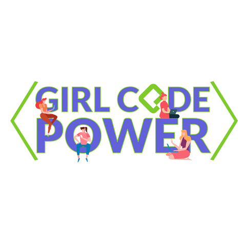

<h1 align="center">Hi 👋, I'm Anjali</h1>
<h3 align="center">A passionate Android & Backend Web developer from India.</h3>

  

 <a href="https://github.com/ryo-ma/github-profile-trophy"> </a> 
 

- 🔭 I’m currently working on **Web projects and preparing for hackathons** [My Work](https://github.com/anjali1361/30-days-of-web/tree/master)

- 🌱 I’m currently learning **Java for Industry level.Taught by one of our Alumuni at BIT Sindri**

- 👯 I’m looking to collaborate **with product based companies**

- 🤝 I’m looking for help with **creating production ready application.**

- 👨‍💻 All of my projects are available at [https://github.com/anjali1361](https://github.com/anjali1361)

- 📝 I regularly write articles on [https://anjali1361.github.io/my_blog/](https://anjali1361.github.io/my_blog/)

- 💬 Ask me about **Android and Web development on both frontend and backend.**

- 📄 Know about my experiences [file:///C:/Users/rajes/AppData/Local/Temp/AnjaliKumari_InternshalaResume.pdf](file:///C:/Users/rajes/AppData/Local/Temp/AnjaliKumari_InternshalaResume.pdf)

- ⚡ Fun fact **I think I am mad**

 <h3 align="left">Connect with me:</h3>

 

<h3 align="left">Languages and Tools:</h3>

 &nbsp;&nbsp;&nbsp;&nbsp;&nbsp;&nbsp;  &nbsp;&nbsp;&nbsp;&nbsp; &nbsp;&nbsp; &nbsp;&nbsp;&nbsp;&nbsp;&nbsp;&nbsp;&nbsp;&nbsp;&nbsp;&nbsp;&nbsp;&nbsp;&nbsp;&nbsp;&nbsp;&nbsp;&nbsp;&nbsp;&nbsp; &nbsp;&nbsp;&nbsp;&nbsp;
  

&nbsp;&nbsp;

&nbsp;
